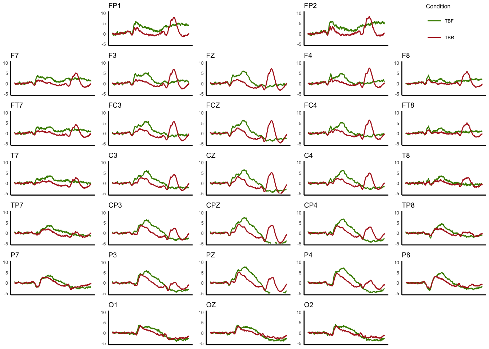
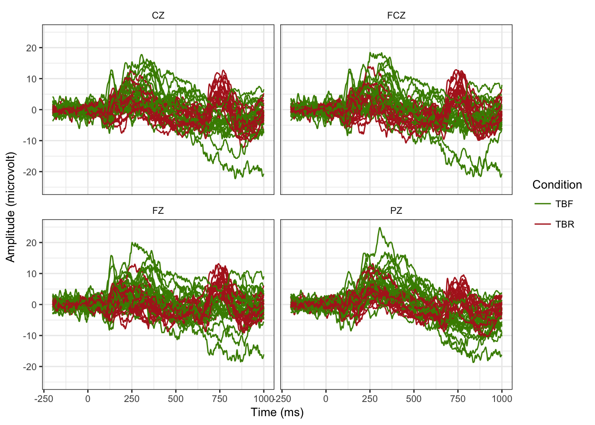
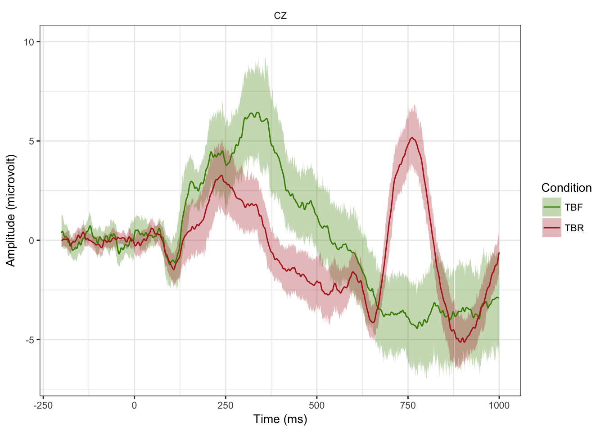
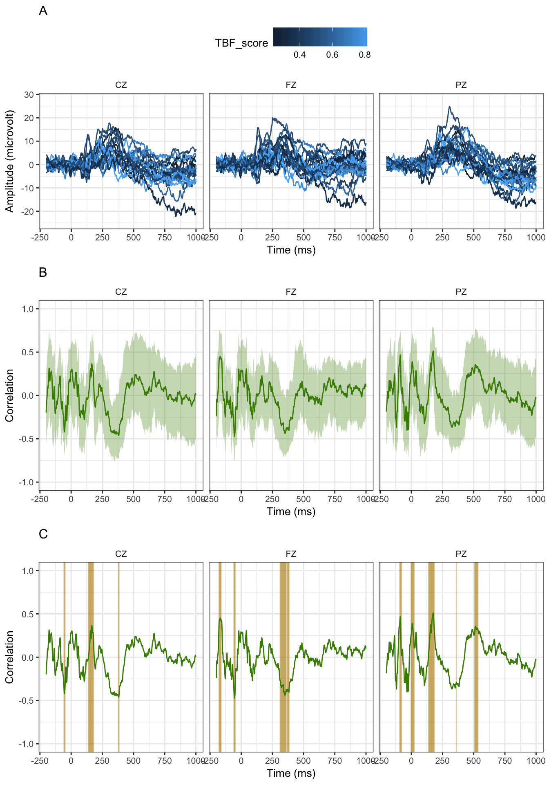

## `ggerp`: Graphical exploration of ERP data with R

<!-- README.md is generated from README.Rmd. Please edit that file -->

`ggerp` considers event-related potentials (ERPs) data analysis in a
standard linear model setting and implements a set of functions in R to
facilitate visual exploration of data and display of statistical testing
results.

These R functions are based on [`ggplot2
package`](https://cran.r-project.org/web/packages/ggplot2/ggplot2.pdf)
to enable step-by-step revision of graphic objects. We also adopts
significant testing procedure provided by [`ERP
package`](https://cran.r-project.org/web/packages/ERP/index.html).

Beyond rendering conditioning plots of ERPs on the scalp map, with these
functions in `ggerp` users can create animation for displaying
significant effects across electrode locations over time by using
[`gganimate package`](https://github.com/dgrtwo/gganimate).

The `ggerp` can be installed using
[`devtools`](https://github.com/hadley/devtools):

    install_github("PsyChiLin/ggerp")

**Packages Preparation**

The following R command lines illustrate the exploration of ERP data
using advanced graphical tool `ggerp` available in R.

Load (and install) packages.

``` r
library(pacman)
pacman::p_load(ERP, mnormt, fdrtool, tidyverse, gridExtra, crayon,
               boot, reshape2, ggthemes, devtools)
```

Install `ImageMagick` within R. Please check all boxes.

``` r
#install.ImageMagick()
```

Install and load `gganimate` and `animation` from github.

``` r
#install_github("yihui/animation")
#install_github("dgrtwo/gganimate")
library(animation)
library(gganimate)
```

Load `ggerp`.

``` r
library(ggerp)
```

**Data Preparation** We demonstrate the graphical capabilities of
`ggerp` with these real data set `DirectedForgetting`. Download data
`DirectedForgetting` from [this
website](https://www.dropbox.com/s/20uhxsmcbex3i0m/DirectedForgetting.csv?dl=0)
or directly use the build-in one. It contains variables named
`TBR_score` and `TBF_score` (continuous), `Condition` (categorical), and
one variable per time point (ERP values, i.e, `T_1200`). The scope of
possible linear modeling designs is therefore quite large. The command
lines shall be marginally adpated to your own ERP dataset. Note that
`Condition`, which is a with-subject variable, could also be changed to
a between subject variable `Group` in your own dataset.

``` r
# dta <- read.csv("DirectedForgetting.csv")
dta <- DirectedForgetting
```

The sequence of time points is generated, called `time_pt`.

``` r
time_pt <- seq(-200, 1000, 1)
```

Specify channels in the data file `erpR_coord` according to their scalp
locations.

``` r
erpR_coord <- rbind(c(NA, "FP1", NA, "FP2", NA),
                    c("F7", "F3", "FZ", "F4", "F8"),
                    c("FT7", "FC3", "FCZ", "FC4", "FT8"),
                    c("T7", "C3", "CZ", "C4", "T8"),
                    c("TP7", "CP3", "CPZ", "CP4", "TP8"),
                    c("P7", "P3", "PZ", "P4", "P8"),
                    c(NA, "O1", "OZ", "O2", NA))
```

**Average ERP curves for conditions on the 10/10 system**

``` r
Fig01 <- plot_tete(data = dta,
                   frames = time_pt,
                   channel = 5,
                   subject = 1,
                   uV = 6:1206,
                   test = 4,
                   mode = "mean",
                   scalp = TRUE,
                   curve.col = c("chartreuse4","firebrick"),
                   coord.mat = erpR_coord,
                   ylim = c(-5, 10))
```



**Individual ERP curves by condition from four channels.**

First, restrict the data to four channels

``` r
dta_c <- filter(dta,Channel %in% c("FZ", "FCZ", "CZ", "PZ")) %>%
        droplevels()
```

Then, create the plot.

``` r
Fig02 <- plot_tete(data = dta_c,
                   frames = time_pt,
                   channel = 5,
                   subject = 1,
                   uV = 6:1206,
                   test = 4,
                   mode = "raw",
                   ylim = c(-25, 25))
```



**Confidence intervals for mean ERP curves on CZ.**

First restrict the data to channel CZ.

``` r
dta_c <- filter(dta, Channel == "CZ" ) %>%
        droplevels()
```

Seed random number generator for replication

``` r
set.seed(123)
```

Then, create the plot in two stages.

``` r
Fig03 <- plot_tete(data = dta_c,
                   frames = time_pt,
                   channel = 5,
                   subject = 1,
                   uV = 6:1206,
                   test = 4,
                   mode = "bootci",
                   ylim = c(-7, 10))+
        theme(legend.position = c(.9, .9))
```



**Results of significant testing comparing conditions for three
channels**

First restrict the data to three channels.

``` r
dta_c <- dta %>%
        filter(Channel %in% c("FZ","CZ","PZ")) %>%
        droplevels()
```

Then, create the plot.

``` r
Fig04 <- plot_fa(data = dta_c,
                 frames = time_pt,
                 channel = 5,
                 subject = 1,
                 uV = 6:1206,
                 test = 4,
                 mode = "test_signal",
                 design = (~Subject + Condition),
                 design0 = (~Subject),
                 nbf = 5,
                 ylim = c(-6, 7.5))
```


**Significant changes across channels over time on the scalp**

First, save test results.

``` r
test_res <- plot_fa(data = dta,
                    frames = time_pt,
                    channel = 5,
                    subject = 1,
                    uV = 6:1206,
                    test = 4,
                    mode = "test_signal",
                    design = (~Subject + Condition),
                    design0 = (~Subject),
                    nbf = 5,
                    ylim = c(-6, 13))
```

Then, create GIF file for animation. The example Gif file could be
download on [this
website](https://www.dropbox.com/s/p80k9jmbburzynv/Fig05.gif?dl=0).

``` r
Fig05 <- plot_coord(tests_rst = test_res$Test_Rst,
                    frames = time_pt,
                    show = seq(200, 500, by = 1),
                    loop = 1,
                    interval = 0.1, 
                    filename = "Fig05.gif")
```

**Associations between ERPs and a numerical covariate**

First restrict the data to three channels.

``` r
dta_c <- dta %>%
        filter(Condition == "TBF", Channel %in% c("FZ","CZ","PZ")) %>%
        droplevels()
```

Produce each plot respectively.

``` r
Fig06a <- plot_tete(data = dta_c,
                    frames = time_pt,
                    channel = 5,
                    subject = 1,
                    uV = 6:1206,
                    test = 3,
                    mode = "raw",
                    ylim = c(-25, 28))
Fig06a <- Fig06a + 
                theme(legend.position = "top", legend.box = "horizontal")
Fig06b <- plot_tete(data = dta_c,
                    frames = time_pt,
                    channel = 5,
                    subject = 1,
                    uV = 6:1206,
                    test = 3,
                    mode = "bootci",
                    ylim = c(-1, 1),
                    labs = list(y = "Correlation", x = "Time (ms)"))
Fig06c <- plot_fa(data = dta_c,
                  frames = time_pt,
                  channel = 5,
                  subject = 1,
                  uV = 6:1206,
                  test = 3,
                  mode = "test",
                  design = (~TBF_score),
                  nbf = 5,
                  ylim=c(-1, 1),
                  labs = list(y = "Correlation", x = "Time (ms)"))
```

Combine the plots to a final figure.

``` r
grid.arrange(Fig06a +
                     ggtitle("A") +
                     theme(plot.title = element_text(hjust = 0)),
             Fig06b +
                     ggtitle("B") +
                     theme(plot.title = element_text(hjust = 0)),
             Fig06c$Plot +
                     ggtitle("C") +
                     theme(plot.title = element_text(hjust = 0)))
```


